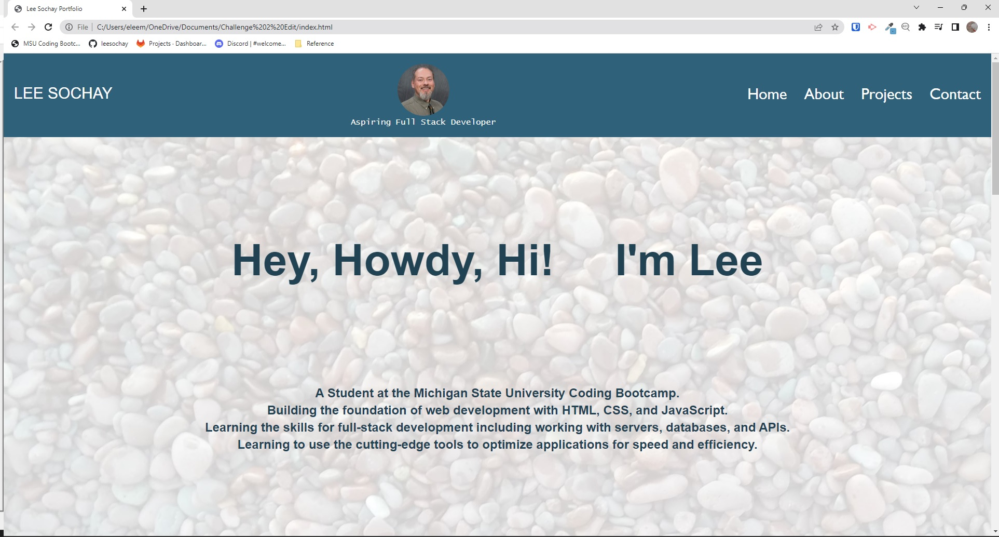

# Lee-Sochay-Portfolio

## Description

This challenge started from scratch with the development of a professional portfolio utilizing HTML and CSS.
The focus for this week was to utilize advanced CSS, specifically flexbox, media queries, and CSS variables to create an interactive and responsive portfolio webpage.
The general layout includes sections for the header, introduction/salutation, about me (education, experience, professional organizations, publications, and skills),
projects, and contact information.
To make these sections, flexbox was used to provide the containers for positioning and styling.
Media Queries were used to provide responsiveness based on the screen width.
And finally, CSS variable(s) were used to provide a color style that can be used in areas within the CSS file.

This is a beginning effort to build a professional portfolio to satisfy the acceptance criteria based on the User Story.

Acceptance Criteria includes the presentation of the developer's name, a recent photo, and links to sections about them, their work, and how to contact them.
The navigation will link to the apprpriate corresponding sections.
In the projects section, there are titled images that link to the project page.
The first project is sized larger than the other projects in the work section.
Lastly, there are responsive layout design techniques to present the inormation adapting to the users screen size.

## Usage

By creating the HTML and CSS as described, the portfolio demonstrates instances of satisfying the user story and acceptance criteria. As a working document, it does leave room for updates and improvements as knowledge and skills are expanded.

The finished project page can be viewed at [leesochay.github.io/Horiseon-Code-Refractor-Challenge](https://leesochay.github.io/Horiseon-Code-Refractor-Challenge/).

## License

MIT License
